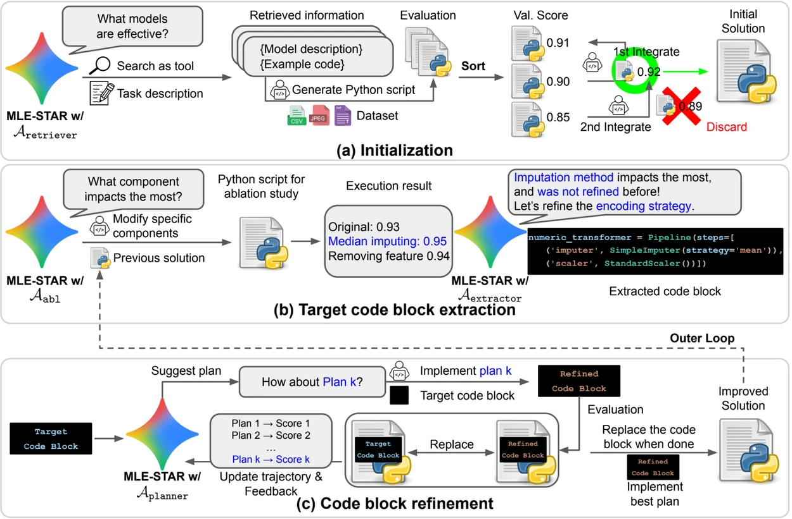

+ 根據圖片概覽：
  + 
	1. (a) MLE-STAR 首先透過網路搜尋找到並將特定任務的模型納入初始解決方案。
	2. (b) 對於每個細化步驟，它進行消融研究以確定對性能影響最大的代碼塊。
	3. (c) 然後根據 LLM 提出的計劃，對識別的程式碼區塊進行迭代優化，該計劃探索使用前次實驗反饋的各種策略。
	4. 這種程式碼區塊選擇和細化過程重複進行，其中改進的 (c) 解決方案成為接下來的細化步驟的起點 (b)。
1. 專案用途是什麼? 請詳細說明。對象是大學生程度但不會"機器學習"知識的人。
2. 專案的 iuput/output 分別是什麼? 各自用途是什麼? 專案最終產出那些成果? 有什麽作用?
3. 專案用到那些LLM? 分別使用在哪裡? LLM產生什麽結果?
4. kaggle 有 [california-housing-prices](https://www.kaggle.com/search?q=california-housing-prices) 的內容，與本專案有何相關?

---
+ 因為是網路受限環境(需要 prxoy 才能連接外網，並有部分外網無法訪問)
+ LLM 與 "模型" 請明確用不同描述區分開
+ 請補充說明
	1. 什麽是"機器學習模型"?
	2. 什麽是"LightGBM"、"XGBoost"、"RandomForest"?
	3. 從哪裡可以找到"機器學習模型"與"模型範例"。請提供網址。
	4. 初始解決方案的數量如何影響專案結果?
	5. 什麽是"消融研究"(ablation study)?
	6. 將"多個模型組合（ensemble）以獲得更好的預測結果"。組合了那些模型?
	7. 什麽是"資料清理"、"特徵工程"、"模型選擇"、"參數調整"、"模型整合"?
	8. "要嘗試的模型候選數量" 這裡的模型是"模型"還是"LLM"? 模型候選有那些? 數量多少如何決定?
	9. 調整配置參數（如任務類型、評估指標等）會有哪些影響，請針對每個配置參數詳細說明
	10. 所謂"多輪優化改進的完整訓練程式" 請詳細說明程式邏輯，改進了那些內容用來達成更好的預測準確度?
	11. A_retriever、A_abl、A_extractor、A_planner、A_ensemble 在這個task 範例中各自呼叫 LLM 幾次? 呼叫次數如何決定? 如何修改"呼叫次數"?
	12. A_retriever、A_abl、A_extractor、A_planner、A_ensemble 如果需要設定為不同 LLM，請根據需求能力給予不同等級(等級簡單分區為1-5，5級最高)
	13. 什麽是"獎牌率" ? "43.9%"與"63.6%" 數字的大小分別代表什麽意義?
---
+ 針對專案還有哪些需要補充說明的部分?
+ 產生 markdown 格式的檔案 "MLE-STAR-專案說明.md"
